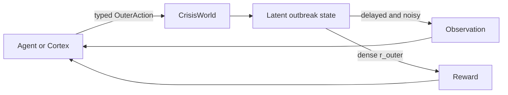
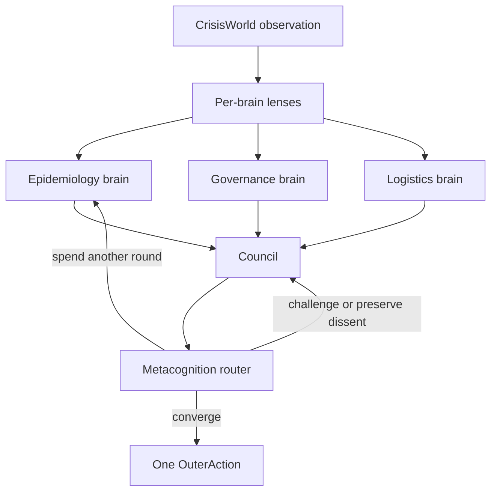
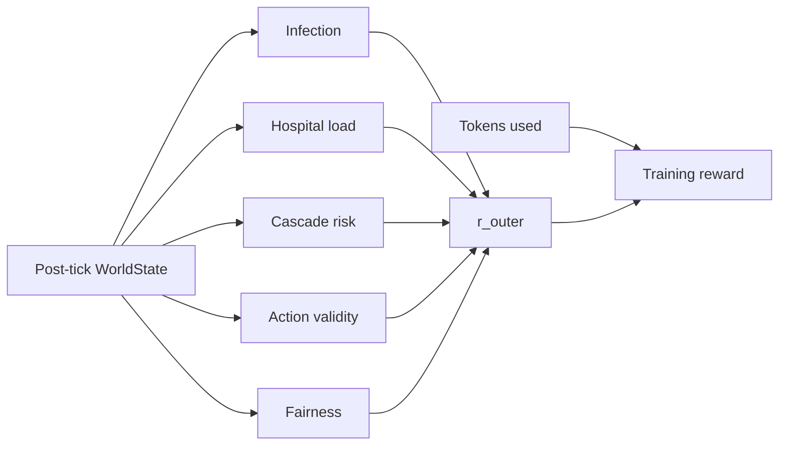

# CrisisWorldCortex Environment

CrisisWorldCortex is an OpenEnv benchmark for crisis governance under partial
observability. The outer environment, **CrisisWorld**, is a regional outbreak
simulator with delayed telemetry, noisy measurements, scarce resources, legal
constraints, hidden cascade events, and typed interventions. The inner agent
system, **Cortex**, treats cognition itself as a budgeted control problem:
which expert brain to consult, when to challenge consensus, when to recurse,
and when to stop thinking and act.

The core thesis is simple:

> Same base model. Same compute. Better governance of thought should produce
> better control of the world.

Most environments reward only the final action. CrisisWorldCortex also makes
the path to that action measurable: action validity, token budget, disagreement
health, collapse risk, and the external outbreak outcome can all be tracked
separately. That is the novelty: cognition is not hidden inside a prompt; it is
an explicit, testable, trainable surface.



## Why It Matters

CrisisWorldCortex is built to test a stronger claim than "more agents are
better." Naive multi-agent systems often converge too early, repeat the same
prior, or let a single judge collapse diverse reasoning into soft consensus.
This benchmark asks whether a structured, budgeted council can outperform flat
agents under matched model and token constraints.

The environment is therefore designed around three properties:

- **High-stakes partial observability**: reported cases are delayed and noisy,
  while hospital load, compliance, resources, and action history form the
  operational picture.
- **Typed, enforceable action space**: six MVP actions are legal; V2-only or
  illegal actions are rejected and penalized without corrupting state.
- **Dense reward signal**: per-tick reward separates active useful policies
  from no-op, rejected, and parse-failure behavior, making training and
  ablation curves meaningful.



## Quick Start

The simplest way to use the environment is through the
`CrisisworldcortexEnv` class:

```python
from CrisisWorldCortex import CrisisworldcortexAction, CrisisworldcortexEnv
from CrisisWorldCortex.models import DeployResource, RequestData

env = CrisisworldcortexEnv.from_docker_image("CrisisWorldCortex-env:latest")

try:
    result = env.reset(task_name="outbreak_easy", seed=0, max_ticks=12)
    obs = result.observation
    print(f"Reset: tick={obs.tick}, regions={len(obs.regions)}")

    actions = [
        RequestData(region="R1", data_type="case_survey"),
        DeployResource(region="R1", resource_type="test_kits", quantity=100),
    ]

    for payload in actions:
        result = env.step(CrisisworldcortexAction(action=payload))
        obs = result.observation
        print(f"Action: {payload.kind}")
        print(f"  tick: {obs.tick}")
        print(f"  reward: {result.reward:.3f}")
        print(f"  done: {result.done}")

finally:
    env.close()
```

The `CrisisworldcortexEnv.from_docker_image()` method handles:
- Starting the Docker container
- Waiting for the server to be ready
- Connecting to the environment
- Container cleanup when you call `close()`

## Building the Docker Image

Before using the environment from Docker, build the image:

```bash
# From project root
docker build -t CrisisWorldCortex-env:latest -f server/Dockerfile .
```

For the hackathon inference harness, the root `Dockerfile` is also present:

```bash
docker build -t CrisisWorldCortex-runner:latest .
```

## Deploying to Hugging Face Spaces

You can deploy the OpenEnv environment to Hugging Face Spaces using
`openenv push`:

```bash
# From the environment directory, where openenv.yaml is located
openenv push

# Or specify options
openenv push --repo-id my-org/CrisisWorldCortex --private
```

The `openenv push` command will:
1. Validate that the directory is an OpenEnv environment
2. Prepare a Hugging Face Docker Space build
3. Upload the Space, assuming Hugging Face auth is configured

After deployment, your Space will be available at:

```text
https://huggingface.co/spaces/<repo-id>
```

The deployed Space includes:
- **Web Interface** at `/web` - standard OpenEnv UI
- **Cortex Dashboard** at `/cortex` - project-specific visual interface
- **API Documentation** at `/docs` - OpenAPI/Swagger docs
- **Health Check** at `/health` - container health monitoring
- **WebSocket** at `/ws` - persistent session endpoint

## Environment Details

### Tasks

| Task | Regions | What changes |
|---|---:|---|
| `outbreak_easy` | 4 | Lower spread, 1-tick telemetry delay, generous resources |
| `outbreak_medium` | 4 | Higher spread, 2-tick delay, scarcer resources, multiple hot regions |
| `outbreak_hard` | 5 | Higher spread, 3-tick delay, chain cascade, legal constraint, hidden superspreader |

Training episodes default to 12 ticks. Evaluation can pass `max_ticks=20`
when longer-horizon behavior is needed.

### Action Space

`CrisisworldcortexAction` wraps one typed `OuterActionPayload`.

| Action kind | Purpose |
|---|---|
| `deploy_resource` | Send test kits, hospital beds, mobile units, or vaccines to a region |
| `request_data` | Reduce telemetry noise for a region for a few ticks |
| `restrict_movement` | Apply none/light/moderate/strict movement restrictions |
| `escalate` | Escalate authority; national escalation unlocks strict restrictions |
| `reallocate_budget` | Move resources between inventory classes with efficiency loss |
| `no_op` | Advance the tick without intervention |

`public_communication` exists only as a V2 forward-compatible schema. In the
MVP it is rejected at runtime and receives a policy penalty.

### Observation Space

`CrisisworldcortexObservation` contains:
- `regions`: delayed reported cases, current hospital load, compliance proxy
- `resources`: current inventory for each resource class
- `active_restrictions`: region-level policy constraints currently in force
- `legal_constraints`: rules that block specific actions until unlocked
- `tick` and `ticks_remaining`
- `cognition_budget_remaining`: per-tick token budget surface
- `recent_action_log`: last accepted or rejected actions

Latent SEIR state is never exposed on the wire. The agent must infer the
world from delayed/noisy telemetry and operational signals.

### Reward

The environment returns a dense per-tick `r_outer` in `[-1.0, 1.0]`:

```text
r_outer =
  0.15 * infection_control
+ 0.05 * time_remaining
+ 0.10 * hospital_pressure
+ 0.10 * cascade_control
+ 0.55 * policy_validity
+ 0.05 * fairness
```

Policy validity is deliberately strong because it gives the learner a clean
gradient:
- Accepted real intervention: `+1.0`
- Accepted `no_op`: `0.0`
- Rejected legal/V2 action: `-0.5`
- Parse-failure marker: `-1.0` and terminal failure

Regression tests lock the reward signal quality:
- all-`no_op` mean reward on `outbreak_easy` must stay below `0.40`
- all-rejected mean reward must stay below `0.40`
- active strategic deployment must stay above `0.50`
- active-vs-no-op separation must stay at least `0.20`



## Baselines and Cortex

The repository includes controlled comparisons rather than only a single
hero agent:

- `baselines/flat_agent.py` - B1, one LLM call per tick.
- `baselines/flat_agent_matched_compute.py` - B2, self-critique and revision
  under the same 6000-token per-tick envelope.
- `baselines/cortex_fixed_router.py` - B3, Cortex with a deterministic router.
- `cortex/` - typed subagents, per-brain lenses, council orchestration,
  anti-hivemind protocol, metacognition, and routing policy interfaces.
- `training/` - reward shaping, rollout buffer, eval metrics, and notebook
  surfaces for GRPO/TRL-style training.

The important comparison is not "Cortex used more thought." B2 exists to
match compute. Cortex has to win by allocating thought better: preserving
useful dissent, challenging overconfident consensus, and converging only
when the action is ready.

## Running the Inference Harness

`inference.py` runs the flat baseline across the three-task ladder and emits
the validator-facing stdout format:

```text
[START] task=<task> env=CrisisWorldCortex model=<model>
[STEP] step=<N> action=<action> reward=<r> done=<true|false> error=<error|null>
[END] success=<true|false> steps=<N> score=<score> rewards=<...>
```

Required:
- `HF_TOKEN`
- One of `LOCAL_IMAGE_NAME` or `ENV_URL`

Optional:
- `API_BASE_URL` - defaults to `https://router.huggingface.co/v1`
- `MODEL_NAME` - defaults to `Qwen/Qwen2.5-72B-Instruct`

Example:

```powershell
$env:HF_TOKEN = "<token>"
$env:LOCAL_IMAGE_NAME = "CrisisWorldCortex-env:latest"
uv run python inference.py
```

## Advanced Usage

### Connecting to an Existing Server

If a CrisisWorldCortex server is already running, connect directly:

```python
from CrisisWorldCortex import CrisisworldcortexAction, CrisisworldcortexEnv
from CrisisWorldCortex.models import NoOp

env = CrisisworldcortexEnv(base_url="http://localhost:8000")

result = env.reset(task_name="outbreak_medium", seed=1, max_ticks=12)
result = env.step(CrisisworldcortexAction(action=NoOp()))
```

When connecting to an existing server, `env.close()` closes the client
connection but does not stop the server process.

### Context Manager

The client supports context manager usage for automatic connection cleanup:

```python
from CrisisWorldCortex import CrisisworldcortexAction, CrisisworldcortexEnv
from CrisisWorldCortex.models import DeployResource

with CrisisworldcortexEnv(base_url="http://localhost:8000") as env:
    result = env.reset(task_name="outbreak_easy", seed=0)
    result = env.step(
        CrisisworldcortexAction(
            action=DeployResource(
                region="R1",
                resource_type="test_kits",
                quantity=100,
            )
        )
    )
```

The client uses WebSocket sessions for:
- Lower latency across many sequential steps
- Persistent environment state per session
- Cleaner episode loops for training and evaluation

## Development & Testing

Install dependencies:

```bash
uv sync --extra dev
```

Run the server locally:

```bash
uv run server --port 8000
```

Run tests:

```bash
uv run pytest tests/ -v
uv run ruff check .
```

Useful direct checks:

```bash
# OpenEnv validation
uv run openenv validate -v

# Smoke one environment episode through tests
uv run pytest tests/test_smoke_env.py tests/test_reward_signal_quality.py -v
```

## Project Structure

```text
CrisisWorldCortex/
|-- README.md
|-- openenv.yaml
|-- pyproject.toml
|-- Dockerfile
|-- inference.py
|-- client.py
|-- models.py
|-- server/
|   |-- app.py
|   |-- CrisisWorldCortex_environment.py
|   |-- simulator/
|   |   |-- seir_model.py
|   |   `-- tasks.py
|   `-- graders/
|       `-- outer_reward.py
|-- cortex/
|   |-- council.py
|   |-- routing_policy.py
|   |-- metacognition.py
|   |-- lenses.py
|   |-- subagents/
|   `-- brains/
|-- baselines/
|   |-- flat_agent.py
|   |-- flat_agent_matched_compute.py
|   `-- cortex_fixed_router.py
|-- training/
|   |-- reward_shaping.py
|   |-- rollout_buffer.py
|   `-- eval_metrics.py
|-- frontend/
|   `-- index.html
`-- tests/
```
